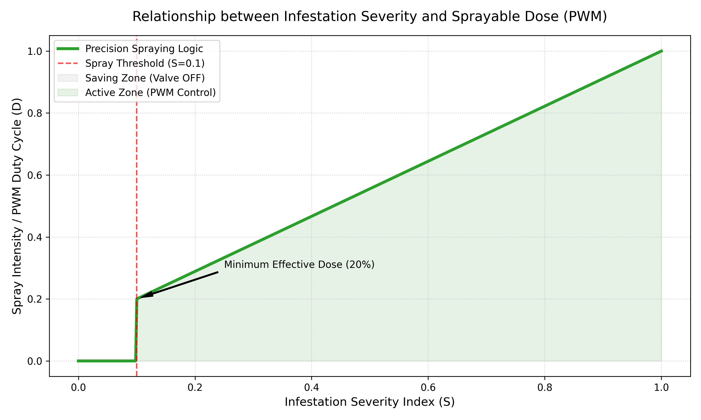
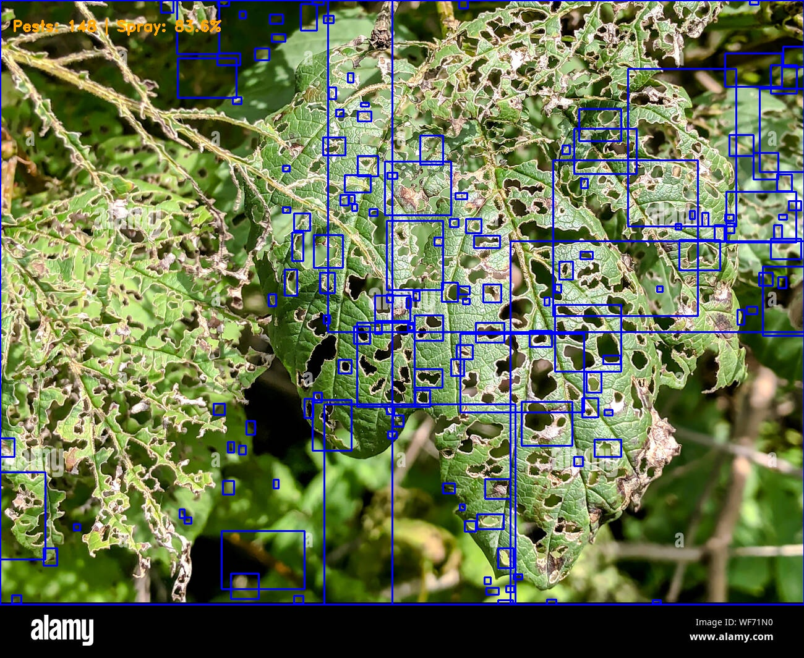
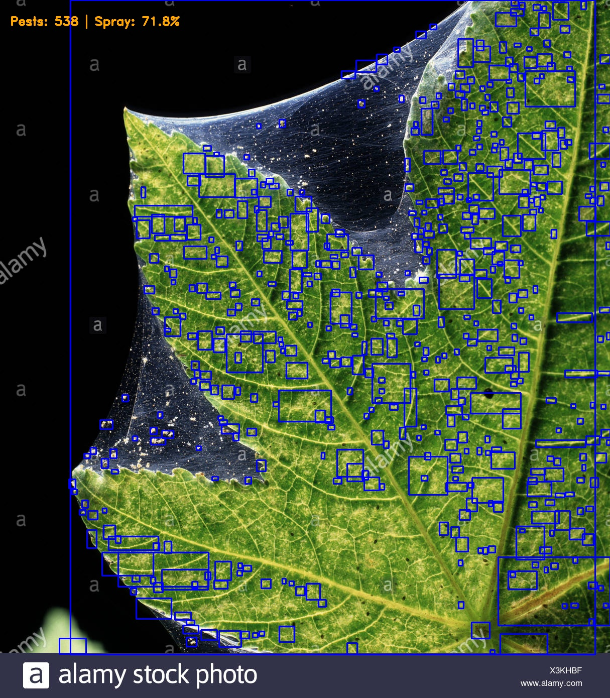
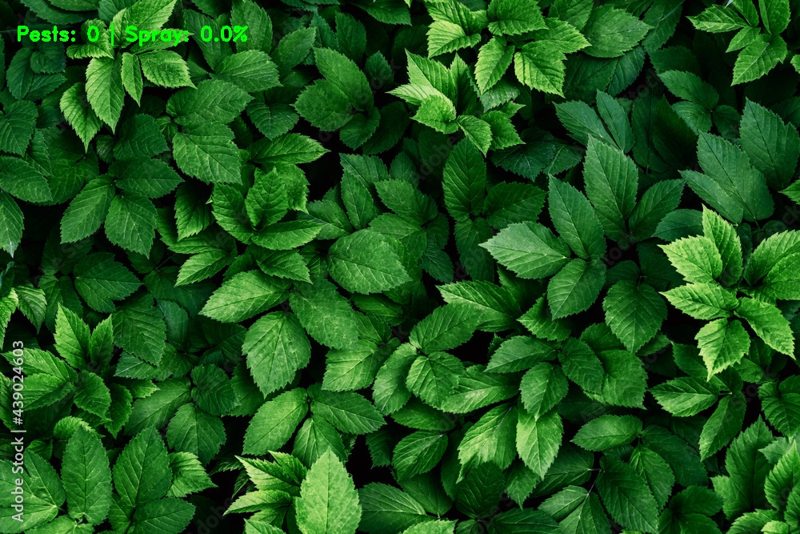

<div align="center">

# 🌿 A Unified Simulation Framework for Real-Time Precision Pesticide Spraying

### Using HSV-Based Pest Localization and Proportional PWM Actuation

<br/>

[](https://ieeexplore.ieee.org/)
[](https://ieeexplore.ieee.org/)
[](https://www.python.org/)
[](LICENSE)

<br/>

**2026 International Conference on Computational Robotics, Testing and Engineering Evaluation (ICCRTEE)**
Department of Electronics & Communication Engineering · Chennai Institute of Technology, Chennai, India

</div>

---

> 🎯 **In one line:** A fully-software simulation that detects pests from crop-canopy images using HSV color segmentation, scores infestation severity, and drives a proportional PWM spray valve — cutting simulated pesticide use by **58.25 %** compared to conventional blanket spraying, **with no physical hardware required.**

---

## 👥 Authors

| Author | Affiliation |
| :-- | :-- |
| **Thamizh Fathima Z** | Dept. ECE, Chennai Institute of Technology |
| **Seku Mohamed Hanifa A** | Dept. ECE, Chennai Institute of Technology |
| **V Paresh Kumar** | Dept. ECE, Chennai Institute of Technology |
| **Dr. C. Gnana Kousalya** | Dept. ECE, Chennai Institute of Technology |

---

## 📑 Abstract

The accurate application of pesticides is critical for modern agriculture — both to minimize chemical impact on the environment and to reduce the economic cost of excessive spraying. This work presents a **simulation-based, stationary, real-time precision pesticide application system** that integrates pest detection, severity assessment, spatial localization, and proportional spray actuation. A forward-facing virtual camera captures crop-canopy images across varying lighting, noise, and infestation levels. Lightweight image processing enables near real-time pest detection; infestation severity is computed from both the **number of pest clusters** and the **area of damage**; the detected regions are mapped to a virtual nozzle model for targeted spraying; and a **PWM-based actuator with delay modeling** provides precise, deterministic, low-latency chemical control while minimizing usage.

**Keywords —** Precision Agriculture · Pesticide Spraying · Simulation Framework · HSV Color Space · Pest Detection · Severity Index

---

## ✨ Key Results

<div align="center">

| 📊 Metric | Blanket Spraying | Precision Framework | Outcome |
| :-- | :--: | :--: | :--: |
| Chemical consumed (15-frame set) | `15.00 units` | `6.26 units` | **−8.74 units** |
| **Chemical Saving Efficiency** | — | — | **🟢 58.25 %** |
| Healthy-canopy false positives | High | `0` | **100 % saved on healthy areas** |
| Hardware required | — | **None (fully simulated)** | Runs on low-power CPUs |

</div>

---

## 🔬 How It Works — The Workflow

The pipeline converts each canopy frame into a spray command through four automated stages:

```text
   📷 Canopy frame
         │
         ▼
┌─────────────────────┐    ┌─────────────────────┐    ┌─────────────────────┐    ┌─────────────────────┐
│  STAGE 1            │    │  STAGE 2            │    │  STAGE 3            │    │  STAGE 4            │
│  Ingestion &        │ ─▶ │  Feature Extraction │ ─▶ │  Decision Logic &   │ ─▶ │  Actuation &        │
│  Pre-processing     │    │  & Refinement       │    │  Proportional Map   │    │  Reporting          │
│                     │    │                     │    │                     │    │                     │
│  RGB → HSV,         │    │  HSV threshold mask,│    │  Severity Index (S),│    │  Spray simulation + │
│  Gaussian blur      │    │  morphology, contour│    │  PWM duty-cycle map  │    │  CSV data logging   │
└─────────────────────┘    └─────────────────────┘    └─────────────────────┘    └─────────────────────┘
```

### 📥 Stage 1 — Ingestion & Pre-processing
Image frames are loaded and converted from RGB to **HSV (Hue–Saturation–Value)** color space. Separating hue from intensity lets the system see through the deep shadows and lighting variance of a dense canopy — the leading cause of false positives in naive RGB thresholding. A Gaussian blur suppresses leaf-edge noise.

### 🎛️ Stage 2 — Feature Extraction & Refinement
A calibrated HSV mask isolates yellowish-brown pest damage while rejecting healthy green and dark inter-leaf gaps. **Morphological opening** (erosion → dilation with a small kernel) removes speckle noise, and a **spatial area filter** discards tiny contours so only biologically significant pest clusters survive. Verified clusters are marked with **blue bounding boxes**, and their `(x, y, w, h)` geometry feeds the severity model.

### 🧠 Stage 3 — Decision Logic & Proportional Mapping
A weighted **Severity Index (S)** fuses infestation *frequency* and *damaged area* into one normalized score, which is linearly mapped to a **PWM duty cycle** above an activation threshold (see [Methodology](#-methodology)).

### 🚿 Stage 4 — Actuation & Reporting
The valve is driven at the computed duty cycle (with solenoid/hydraulic delay modeling), and every frame's filename, pest count, severity, and spray intensity are logged to a **CSV** for reproducible, dataset-wide analysis.

---

## 🧪 Methodology

### 🌡️ Combined Severity Index

$$S = \omega_1 \cdot \frac{n}{N_{max}} + \omega_2 \cdot \frac{A_p}{A_t}$$

where $n$ = number of pest clusters, $A_p$ = pest-affected pixels, $A_t$ = total pixels, with normalization $N_{max}=50$ and weights $\omega_1=0.6$ (frequency) and $\omega_2=0.4$ (area). $S=0$ → no pests, $S=1$ → full infestation.

### ⚡ Proportional PWM Actuation

$$D = D_{min} + (D_{max}-D_{min}) \cdot \frac{S - S_{thresh}}{1.0 - S_{thresh}}$$

Below the threshold $S_{thresh}=0.10$ the valve stays **OFF** ($D=0$) — treating the region as healthy or a non-crop gap. Above it, the duty cycle scales linearly between $D_{min}=0.20$ (minimum stable spray) and $D_{max}=1.00$ (full discharge).

### 🍃 Chemical Saving Efficiency

$$E_{save} = \left(1 - \frac{\sum D_{precision}}{\sum D_{blanket}}\right) \times 100\%$$

<div align="center">

**Severity → Sprayable Dose relationship (Fig. 6 in the paper)**



</div>

---

## 🖼️ Visual Proof

The simulation overlays **blue bounding boxes** on detected pest clusters and prints the live pest count and computed spray intensity onto each processed frame.

<table>
  <tr>
    <th>🐛 Heavy infestation → high dose</th>
    <th>🐛 Moderate infestation → mid dose</th>
  </tr>
  <tr>
    <td></td>
    <td></td>
  </tr>
  <tr>
    <th>✅ Healthy canopy → valve OFF</th>
    <th>✅ Gap / shadow → no false positive</th>
  </tr>
  <tr>
    <td></td>
    <td></td>
  </tr>
</table>

> The full set of processed frames (bounding boxes + PWM overlay) lives in [`processed_output/`](processed_output/).

---

## 📈 Simulation Results

Output of the integrated perception → proportional-actuation pipeline over the 15-frame validation set (`logs/proportional_report_1911.csv`):

| File | Pests Detected | Severity Index (S) | Spray Intensity (PWM) | Action |
| :-- | :--: | :--: | :--: | :-- |
| 14.jpg | 0 | 0.00 | 0.0 % | ⚪ OFF — gap/shadow |
| 16.jpg | 0 | 0.00 | 0.0 % | ⚪ OFF — gap/shadow |
| i6.png | 0 | 0.00 | 0.0 % | ⚪ OFF — gap/shadow |
| i7.png | 0 | 0.00 | 0.0 % | ⚪ OFF — gap/shadow |
| i8.png | 0 | 0.00 | 0.0 % | ⚪ OFF — gap/shadow |
| l1.jpg | 19 | 0.27 | 35.5 % | 🟢 ON |
| l10.jpg | 66 | 0.60 | 64.6 % | 🟢 ON |
| l11.jpg | 123 | 0.60 | 64.8 % | 🟢 ON |
| l14.jpg | 222 | 0.62 | 66.4 % | 🟢 ON |
| l2.jpg | 837 | 0.64 | 67.9 % | 🟢 ON |
| l4.jpg | 37 | 0.60 | 64.6 % | 🟢 ON |
| l5.jpg | 113 | 0.63 | 67.4 % | 🟢 ON |
| l7.jpg | 82 | 0.61 | 65.0 % | 🟢 ON |
| l8.jpg | 37 | 0.60 | 64.6 % | 🟢 ON |
| l9.jpg | 252 | 0.61 | 65.5 % | 🟢 ON |
| **Total** | — | — | **6.26 units** | **58.25 % saved** |

---

## 🗂️ Repository Structure

```
.
├── main_sim.py                  # Core pipeline: detect → severity → PWM → log
├── calculate_savings.py         # Chemical Saving Efficiency from the latest CSV log
├── graph.py                     # Renders the Severity → PWM dose curve (Fig. 6)
├── dataset/                     # Input crop-canopy frames (healthy + infested)
├── processed_output/            # Frames with bounding boxes + PWM overlay
├── logs/                        # Per-run CSV reports (pests, severity, PWM, action)
├── assets/                      # Curated figures used in this README
├── requirements.txt
├── CITATION.cff
├── LICENSE
└── README.md
```

---

## 🚀 Getting Started

### 1️⃣ Install dependencies

```bash
python -m venv precision_env
# Windows
precision_env\Scripts\activate
# Linux / macOS
source precision_env/bin/activate

pip install -r requirements.txt
```

### 2️⃣ Run the simulation

Place canopy images (`.jpg` / `.png` / `.jpeg`) in `dataset/`, then:

```bash
python main_sim.py
```

Processed frames are written to `processed_output/` and a timestamped CSV report to `logs/`.

### 3️⃣ Compute chemical savings

```bash
python calculate_savings.py
```

### 4️⃣ Regenerate the dose curve

```bash
python graph.py
```

---

## ⚙️ Key Parameters

| Symbol | Meaning | Value |
| :-- | :-- | :--: |
| $N_{max}$ | Pest-count normalization cap | `50` |
| $\omega_1, \omega_2$ | Weights (count, area) | `0.60`, `0.40` |
| $S_{thresh}$ | Spray activation threshold | `0.10` |
| $D_{min}, D_{max}$ | PWM duty-cycle bounds | `0.20`, `1.00` |
| HSV lower / upper | Pest-color mask | `[8,50,40]` / `[35,255,230]` |

*All parameters are defined at the top of `main_sim.py` and `graph.py` for easy tuning.*

---

## 📚 Citation

If you use this work, please cite the paper:

```bibtex
@inproceedings{fathima2026precisionspraying,
  title     = {A Unified Simulation Framework for Real-Time Precision Pesticide
               Spraying Using HSV-Based Pest Localization and Proportional PWM Actuation},
  author    = {Thamizh Fathima, Z. and Seku Mohamed Hanifa, A. and
               Paresh Kumar, V. and Gnana Kousalya, C.},
  booktitle = {2026 International Conference on Computational Robotics, Testing
               and Engineering Evaluation (ICCRTEE)},
  year      = {2026},
  publisher = {IEEE},
  address   = {Chennai, India}
}
```

> 🔗 **IEEE Xplore link & DOI:** replace this line with your paper's IEEE Xplore URL and DOI once available, and update the `doi = {...}` field above.

---

## 📄 License

Released under the [MIT License](LICENSE). The associated paper is © 2026 IEEE.

---

<div align="center">

Made with 🌱 for sustainable, precision agriculture · Chennai Institute of Technology

</div>
